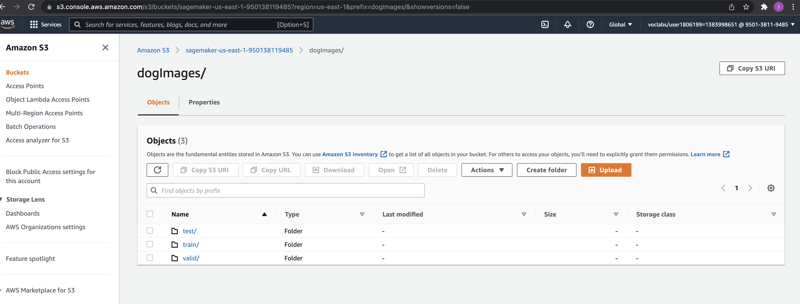
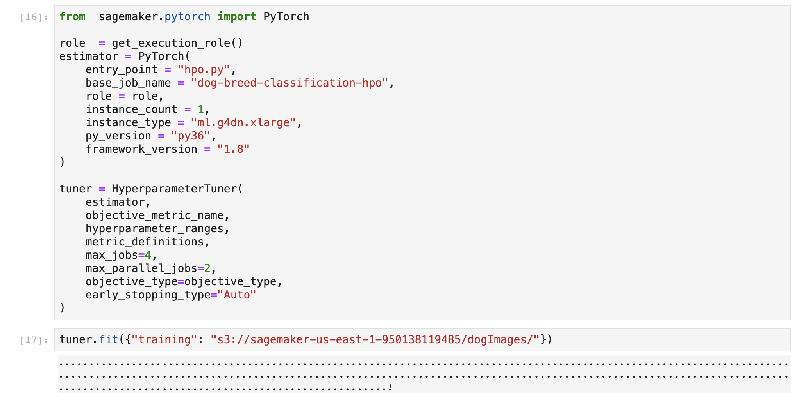
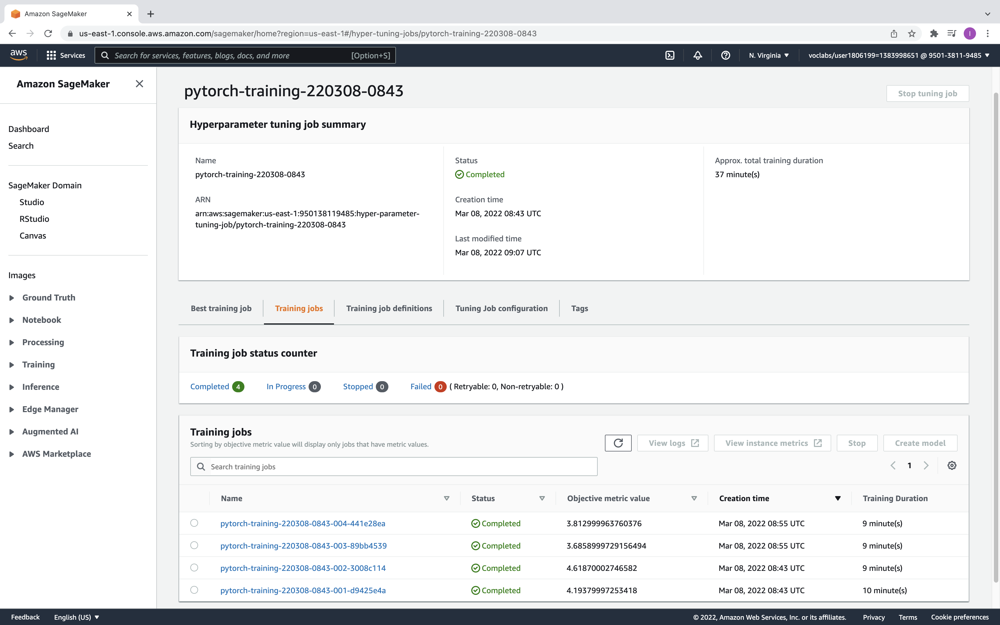
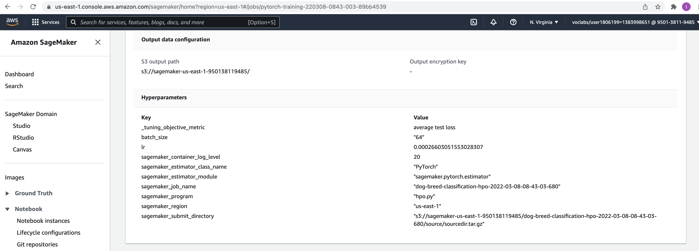
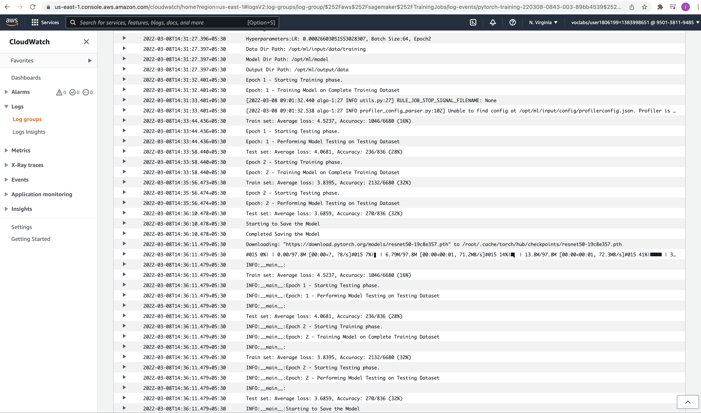
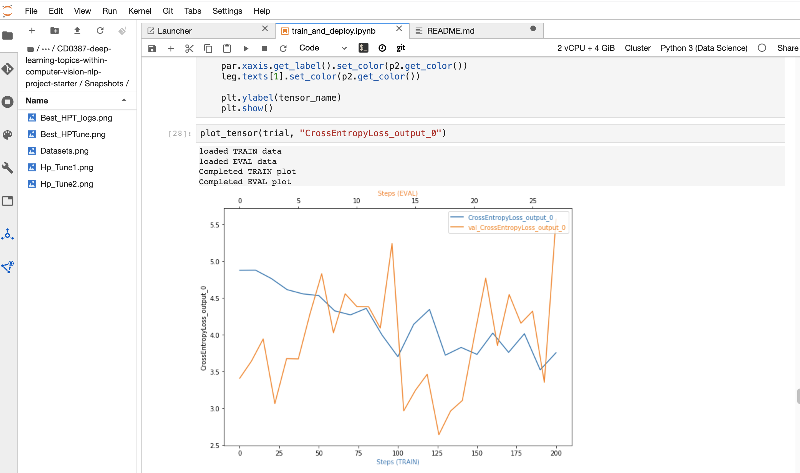
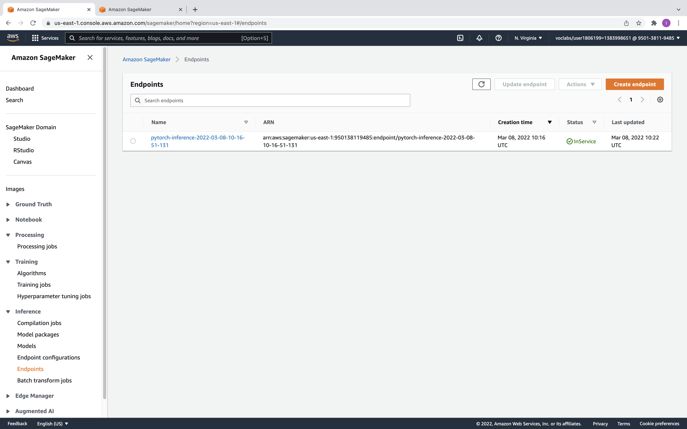
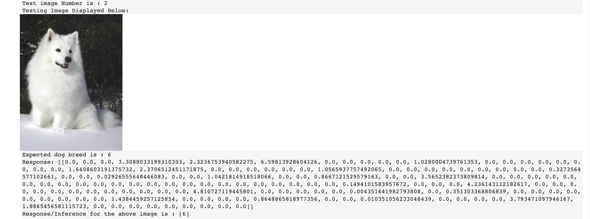

# Image Classification using AWS SageMaker

This is a project on image classification which uses Pre-trained ResNet50 Model and two Trainable Fully Connected Layers to Classify Dog Breeds from an input image into one of the 133 Dog Breed Categories.

## Project Set Up and Installation
Enter AWS through the gateway in the course and open SageMaker Studio. Download the Starter Files and Input DatDatasets. Run Notebbok train_and_deploy.ipynb to perform the Image Classification Task. The notebook has brief descriptions of the steps performed and the underlying rationale.

## Files and Folders in this Repo

* **train_and_deploy.ipynb** this is the notebook which has all the steps and instructions for carrying out the Image Classification Task

* **hpo.py** is the script used in hyperparameter training. 

* **train_model.py** is the script used in performing model training using best hyperparameters selected

* **inference.py** is the script used in making inference by deploying the model and creating an endpoint

* **ProfilerReport** Folder has the profiler output, namely the profiler-report html file and the underlying notebook which has generated this file 

* **TestImages** Folder has the Images on which the model is tested to assess the model results

* **Snapshots** has all the relevant screenshots displyed in this report

## Dataset
The provided dataset is the dogbreed classification dataset which can be found in the classroom.
The project is designed to be dataset independent so if there is a dataset that is more interesting or relevant to your work, you are welcome to use it to complete the project.

### Access
Data has been uploaded to S3 Bucket in SageMaker to be used as Input to the Model. Below is a snapshot of the same.

### Uploaded Data to S3

## Hyperparameter Tuning
We have used pre-trained ResNet50 Model from Pytorch Vision Library - As we are using the concept of Transfer Learning, we are freezing all the convolutional Layers of ResNet50 Model. 

Our Implementation further adds two Fully connected layers with 256 and 133 neurons respectively to the output of ResNet50 pre-trained model -- Note that We will be training only these two FC Layers 

The Hyperrparameters selected for Tuning are:
* Batch Size - Categorical parameter with three levels namely 32, 64 and 128
* Learning Rate -- Continuous parameter between 0.0001 to 0.1

### Successfully completed a Hyperparameter Tuning Job

### Four Training Jobs Triggered and completed in the Hyperparameter Tuning job

### Best Hyperparameter Tuning Job

### Best HyperParameter Tuning Job Logs

Note that the Best Hyperparameters obtained during the Tuning Process is 
* Batch Size -- 64
* Learning Rate -- 0.00026603051553028307

## Debugging and Profiling

We have introduced hooks in the Training Script to keep track of the loss criterion metrics during the training and validation phases. Below is a plot of the cross entropy loss during training and validation phase:

### Cross Entropy Loss Plot 

### Results

There is no anomalous behaviour in the debugger output, we see that the training loss generally decreases with the number of steps. Although Validation Losses are logged more frequently than training losses, we see that the validation loss is somewhat more variable than the training loss. 

With more AWS credits, I would try out different Model Architectures on top of the ResNet50 (e.g., number of FC Layers) and assess the performance. Also, choice of hyperparametes to tune can also be expanded to incorporate the hyperparameters specific to ADAM Optimizer. Finally, altering some default parameters during Hyperparameter Tuning (such as number of epochs = 2) is worth exploring to see if we can get any improved performance.

## Model Deployment

* The model was deployed to **ml.t2.medium** instance type and we used the scipt **inference.py** to perform the deployment and create an endpoint

* To evaluate the Model performance, we have stored a few images in TestImages Folder. For these images, we compute the model output using the Predictor Class Object

### Active Endpoint created

### Predicted Output using Predictor Class Object for a Test Image

